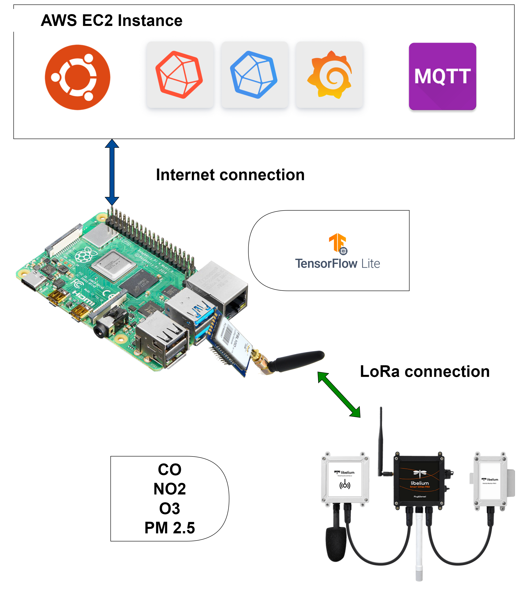

# Raspberry PI
Run AQI_api.py
    - Python 3.7.15
    
    '''
    sudo chmod +x download_tensorflow-2.5.0-cp37-none-linux_armv7l_numpy1195.sh
    ./download_tensorflow-2.5.0-cp37-none-linux_armv7l_numpy1195.sh
    pip install tensorflow-2.5.0-cp37-none-linux_armv7l.whl
    pip install paho-mqtt
    pip install pyserial
    '''

# PC/Laptop
Run web_sim and HTTP2LoRaAdapter. 
    - Python >= 3.9
    
    '''
    pip install "fastapi[all]"
    pip install "uvicorn[standard]"
    pip install pyserial
    '''

# Cloud is TIG stack, that have been setup on AWS EC2 by me.

